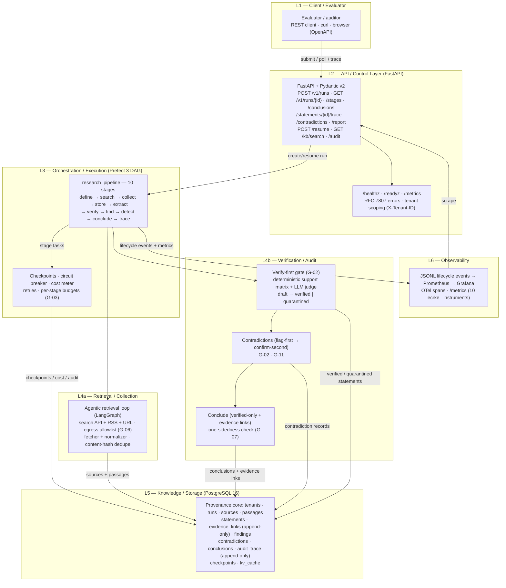

# ECRKE — Architecture

> ECRKE = **E**vidence-**C**entric **R**esearch **K**nowledge **E**ngine.
> This document describes the implemented v1 architecture (tasks 001–014) and how
> the pieces fit together. Diagram sources: `docs/architecture.mmd` (mermaid,
> canonical) and `docs/architecture.svg` (hand-crafted render — same content).
> To produce a PNG (network-enabled environment only):
>
> ```powershell
> npx --yes @mermaid-js/mermaid-cli -i docs/architecture.mmd -o docs/architecture.png
> ```

## 1. Design goals that shape the architecture

1. **Provenance is the product.** Every conclusion must resolve, in ≤ 1 hop per
   edge, to the stored source passage that supports it — statement → passage →
   source. That is a *data model*, not a topology (see `docs/data-model.md`).
2. **Verify-first.** Nothing enters the knowledge base unverified: statements are
   `draft` until a deterministic support-matrix gate + LLM judge promote them to
   `verified` or `quarantined` (G-02).
3. **Resumable, cost-bounded background jobs.** LLM calls never happen in request
   threads; the pipeline runs as a durable Prefect 3 DAG with per-stage budgets,
   checkpoints, and a circuit breaker.
4. **Auditable by construction.** `evidence_links` and `audit_trace` are
   append-only at both the ORM and the database level; every KB write decision is
   recorded.
5. **Tenant-isolated.** Every run-scoped endpoint enforces `X-Tenant-ID`
   (403 on cross-tenant access).

## 2. Layer diagram



> Rendered copy: `docs/architecture.svg` (viewable in any browser). The mermaid
> source in this file and in `docs/architecture.mmd` is canonical — regenerate the
> PNG when the diagram changes.

## 3. Layer-by-layer walkthrough

### L1 — Client / Evaluator
The consumer of the system: an evaluator, auditor, or downstream tool that submits
a research question, polls the run lifecycle, and audits conclusions back to
sources. No UI ships in v1 — the OpenAPI docs (`/docs`) are the primary client
surface.

### L2 — API / Control Layer (FastAPI)
Thin control surface over the pipeline. Ten endpoints (see table below) plus
`/healthz`, `/readyz`, `/metrics`. Design rules:

- The API **never calls an LLM provider directly** — it composes Phase-1 services
  and reads persisted artifacts.
- Every text field is redacted (G-05) before it reaches a response model.
- Error responses follow RFC 7807 Problem Details, rendered by exception handlers
  in `app.main`.
- `POST /v1/runs` returns 201 immediately; when `execute: true` the runner is
  dispatched as a background job (in-process runner by default; `PREFECT_API_URL`
  switches to the Prefect server worker).

| Endpoint | Method | Purpose |
|---|---|---|
| `/v1/runs` | POST | Submit a research question (201) |
| `/v1/runs/{run_id}` | GET | Poll one run's lifecycle state |
| `/v1/runs/{run_id}/stages` | GET | Per-stage durable checkpoint info |
| `/v1/runs/{run_id}/conclusions` | GET | Final conclusions with evidence refs |
| `/v1/statements/{statement_id}/trace` | GET | Provenance chain statement → passage → source |
| `/v1/runs/{run_id}/contradictions` | GET | Flagged/confirmed contradiction records |
| `/v1/runs/{run_id}/report` | GET | Rendered markdown report (no LLM in API) |
| `/v1/runs/{run_id}/resume` | POST | Re-enter pipeline at first missing stage |
| `/v1/kb/search` | GET | Search verified statements across tenant |
| `/v1/runs/{run_id}/audit` | GET | Immutable audit trace export (redacted) |
| `/healthz`, `/readyz`, `/metrics` | GET | Liveness, readiness, Prometheus metrics |

### L3 — Orchestration / Execution (Prefect 3 DAG)
The 10-stage pipeline `research_pipeline` is the canonical execution graph
(`app/pipeline/context.py::STAGES`):

```
define → search → collect → store → extract → verify → find → detect → conclude → trace
```

- Each stage is a Prefect task with a single `PipelineContext` argument
  (stage-isolation guardrail: tasks never reach for globals or extra params).
- `STAGE_STATUS` maps each stage to the observable `runs.status` (e.g. `verify`
  surfaces as `verifying`); `STAGE_PROGRESS` writes evenly spaced progress
  0.1 → 1.0 so a stalled run shows as a frozen progress bar.
- Checkpoints (`checkpoints` table) let a failed/paused run resume at the first
  missing stage; `POST /v1/runs/{id}/resume` re-enters it.
- Cost meter + circuit breaker bound spend (`RUN_BUDGET_USD`,
  `CIRCUIT_BREAKER_MAX_STAGE_FAILURES`; G-03).
- LangGraph agentic loops (retrieval, verification) run inside stages in
  per-subtask isolation.
- With `PREFECT_API_URL` set, the worker executes against the Prefect server
  (Postgres-backed queue — no Redis).

### L4a — Retrieval / Collection
- Agentic retrieval loop over search API + RSS + direct URL connectors.
- Egress is **default-deny**: only domains in `ALLOWED_DOMAINS` (G-06) are
  fetched; every source records `allowlisted_uri`.
- Fetcher + normalizer handle HTML, PDF, DOCX, RTF; raw documents go to the blob
  store (`BLOB_STORE_BACKEND=local` default or S3-compatible).
- Content-hash dedupe (`uq_sources_content_hash`) prevents re-fetching the same
  source; unsafe-content filtering (G-04) and redaction hooks (G-05) apply at
  ingest.

### L4b — Verification / Audit
- **Verify-first gate (G-02):** statements start `draft`; a deterministic
  support-matrix scorer plus a strong-tier LLM judge decide `verified` vs
  `quarantined`. The score (full/partial/none) is persisted on `evidence_links`
  with the method used.
- **Contradictions (G-11):** flag-first (cheap detector) → confirm-second
  (strong judge); only `confirmed` contradictions enter reports.
- **Conclude:** conclusions cite evidence through `conclusion_evidence` — a
  conclusion is never naked. One-sidedness check (G-07) sets
  `human_review_required` on conclusions that lack opposing evidence.

### L5 — Knowledge / Storage (PostgreSQL 16)
The provenance core — 14 tables (see `docs/data-model.md`). Highlights:

- `evidence_links` and `audit_trace` are **append-only**: ORM listeners
  (`app/db/base.py`) *and* Postgres triggers reject UPDATE/DELETE.
- FK `RESTRICT` on append-only tables means a run owning them can never be
  hard-deleted — provenance is tombstoned, never destroyed.
- Checkpoint state, the `kv_cache` (replaces Redis), and the audit trail all live
  in the same ACID database.

### L6 — Observability
- JSONL lifecycle events per run/stage/tool call feed Prometheus; Grafana is
  provisioned with the ECRKE dashboard (`grafana/dashboard.json`).
- OpenTelemetry spans (per run/stage/tool call) via
  `opentelemetry-instrumentation-fastapi`; `/metrics` exposes 10 `ecrke_`
  instruments (`app/core/metrics.py`).
- The eval harness (365 tests, including the hermetic eval gate
  `pytest tests/eval -o addopts="" -p no:warnings`) is wired into CI as the
  gate of record.

## 4. Request lifecycle (end to end)

1. Evaluator calls `POST /v1/runs` with `{"question": "...", "execute": true}`.
2. The API creates a `runs` row (`submitted`, progress 0.0), then dispatches the
   pipeline runner as a background job.
3. Prefect executes the 10-stage DAG; each stage updates `runs.status`/
   `runs.progress`, writes a checkpoint, records cost, and appends audit rows.
4. Stages 1–5 collect, store, extract and dedupe sources/passages.
5. Stage `verify` gates statements; `find` groups them into findings;
   `detect` records contradictions; `conclude` writes evidence-linked conclusions;
   `trace` finalizes the report artifact into `kv_cache` (`trace:{run_id}`).
6. Evaluator polls `GET /v1/runs/{id}`, then reads `/report`, `/conclusions`,
   `/statements/{id}/trace`, `/contradictions`, or `/audit`.

## 5. Deployment shape

- `docker-compose.yml` (compose project `ecrke`): `postgres` (host port 5433),
  `prefect-server` (4200), `api` (host 3456 → container 8000), `worker`; the
  `observability` profile adds `prometheus` (9090) and `grafana` (3000).
- CI (`.github/workflows/ci.yml`): lint/typecheck, tests, hermetic eval gate,
  image build. No push to production happens without human approval
  (Ironclad Rule 03).
- Local development: `.env.example` → `.env`, `docker compose up -d postgres`,
  `.\scripts\dev.ps1 setup` + `verify`.

## 6. Guardrails map

| Guardrail | Where it lives |
|---|---|
| G-01 Evidence-first pipeline | 10-stage DAG; conclusions require evidence links |
| G-02 Verify-first | `verify` stage: support matrix + LLM judge; `verified`/`quarantined` |
| G-03 Budget/cost bounds | cost meter + circuit breaker; `RUN_BUDGET_USD` |
| G-04 Unsafe content | collector filters at ingest |
| G-05 Redaction | `redact_secrets`/`redact_json` on every API response |
| G-06 Egress allowlist | `ALLOWED_DOMAINS` default-deny fetch |
| G-07 One-sidedness | `human_review_required` on conclusions |
| G-11 Contradiction protocol | flag-first → confirm-second |
| G-13 Immutable guardrails | config rejects disabling (`app/core/config.py`) |

See `docs/tech-stack.md` and the design doc for the full guardrail register.
