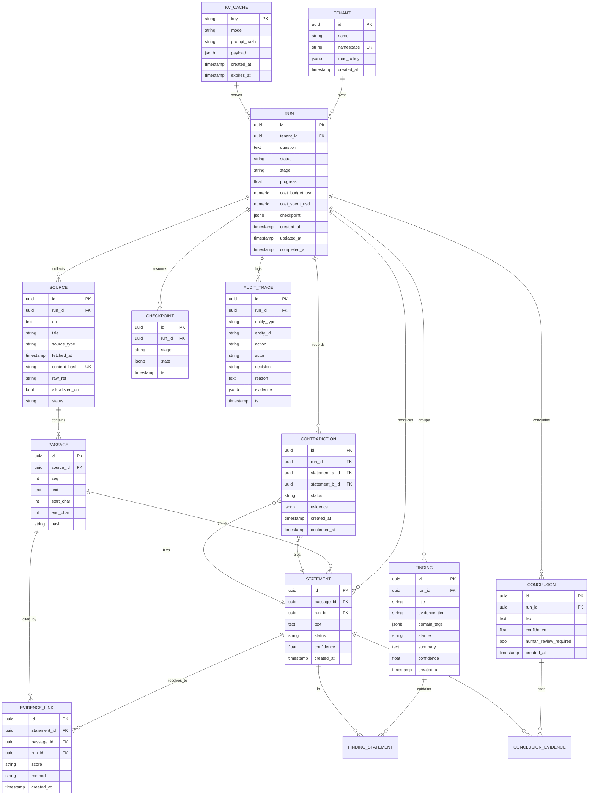

# ECRKE Data Model — Relational Provenance Core

> Source of truth: `app/db/models.py`. Migrations: `alembic/versions/`.
> Conceptual source: design doc `enterprise-research-agent-design.md` §7.
> Canonical ERD: `docs/data-model-erd.mmd` (mermaid); rendered copy
> `docs/data-model-erd.svg` (hand-crafted, viewable in any browser).
> To produce a PNG (network-enabled environment only):
>
> ```powershell
> npx --yes @mermaid-js/mermaid-cli -i docs/data-model-erd.mmd -o docs/data-model-erd.png
> ```

## 1. The idea

Provenance is a **data model**, not a database topology. Every claim the engine
produces must be resolvable, in ≤ 1 hop, to the stored source passage that
supports it. That requirement shapes every table below.

- **Relational core**: PostgreSQL 16, SQLAlchemy 2, Alembic migrations.
- **Append-only backbone**: `evidence_links` + `audit_trace` cannot be edited or
  deleted — at the ORM level *and* at the database level (triggers).
- **Write-governed statuses**: statements are `draft` until a verify-first gate
  promotes them to `verified` or `quarantined`. Nothing enters the KB unverified.
- **Versioning by new rows**: correction/update = new row, never in-place.

## 2. ERD (mermaid)



## 3. Table reference

| Table | Purpose | Append-only? | Key governance |
|---|---|---|---|
| `tenants` | Isolation root | no | namespace unique |
| `runs` | One run = one question | no | progress 0–1, cost ≥ 0 |
| `sources` | Anything fetched (web/PDF/RSS/DOCX/RTF/upload) | no | content_hash unique (dedupe), allowlist flag |
| `passages` | Atomic retrievable units of a source | no | unique (source_id, seq) |
| `statements` | Atomic claims | no | status draft→verified/quarantined only |
| `evidence_links` | statement→passage resolution | **yes** | score ∈ full/partial/none |
| `findings` | Grouped/classified statements | no | evidence tier t1–t4 |
| `finding_statements` | findings↔statements M2M | no | composite PK |
| `contradictions` | Flagged/confirmed conflicts | no | status flagged→confirmed/rejected |
| `conclusions` | Final output | no | every conclusion *must* cite evidence |
| `conclusion_evidence` | conclusions↔statements(+finding) M2M | no | composite PK |
| `audit_trace` | Immutable decision log | **yes** | every KB write decision recorded |
| `checkpoints` | Durable resume points | no | unique (run_id, stage) |
| `kv_cache` | Repeat-call cache (LLM answers, rate counters) — replaces Redis | no | key PK, expiry support |

## 4. Write governance rules (§7.2 of design)

1. **No statement enters the KB unverified.** Draft → support-matrix → verified (or quarantined).
2. **Versioning:** updates create new rows; historical versions remain queryable.
3. **A/B promotion:** high-stakes beliefs require human review (`conclusions.human_review_required`).
4. **Confidence mandatory** on statements, findings, conclusions; decays with time.
5. **Contamination rollback:** a misconception sweep re-runs affected evidence through the
   verification gate only — never a global rebuild.

## 5. Append-only enforcement (belt-and-braces)

`evidence_links` and `audit_trace` are protected twice:

1. **ORM level** (`app/db/base.py`): `before_update` / `before_delete` listeners raise
   `AppendOnlyViolation` for the registered append-only models.
2. **DB level** (initial migration): `BEFORE UPDATE OR DELETE` triggers
   `trg_evidence_links_append_only` / `trg_audit_trace_append_only` raise
   `restrict_violation`. Direct SQL cannot bypass the rule.

Consequence: runs that own append-only rows can never be hard-deleted (FK
`RESTRICT`). That is intentional — provenance is tombstoned, never destroyed.

## 6. Enumerations (stored as strings + CheckConstraints)

Enums live in `app/db/enums.py`; they are stored as plain strings with
`CHECK` constraints so the schema stays migration-friendly while Python gets
type-safe values.

| Enum | Values | Where used |
|---|---|---|
| `RunStatus` | `submitted, planning, searching, collecting, storing, extracting, comparing, verifying, detecting, concluding, tracing, completed, failed, paused, cancelled` | `runs.status` (`valid_run_status`) |
| `SourceType` | `web, pdf, rss, docx, rtf, upload, other` | `sources.source_type` (`valid_source_type`) |
| `SourceStatus` | `pending, fetched, failed, normalized, quarantined` | `sources.status` (`valid_source_status`) |
| `StatementStatus` | `draft, verified, quarantined` | `statements.status` (`valid_statement_status`) |
| `EvidenceScore` | `full, partial, none` | `evidence_links.score` (`valid_evidence_score`) |
| `ContradictionStatus` | `flagged, confirmed, rejected` | `contradictions.status` (`valid_contradiction_status`) |
| `EvidenceTier` | `t1, t2, t3, t4` | `findings.evidence_tier` (`valid_evidence_tier`) |

Stage names (pipeline order, `app/pipeline/context.py::STAGES`):

```
define → search → collect → store → extract → verify → find → detect → conclude → trace
```

Each stage maps to a `runs.status` surface value (`STAGE_STATUS`) and a progress
value (`STAGE_PROGRESS`, 0.1 → 1.0 in 10 steps).

## 7. Verification

- `alembic upgrade head` on a fresh Postgres applies cleanly (14 tables, 20 FKs, 44 indexes, 2 triggers).
- `pytest tests/test_database.py` (Testcontainers Postgres) asserts: migration applies,
  FK/index inventory, append-only at ORM + DB level, seed idempotency, model round-trips.

## 8. Index strategy

| Index | Why |
|---|---|
| `uq_sources_content_hash` | content-hash dedupe (global) |
| `uq_passages_source_seq` | passage ordering within a source |
| `ix_evidence_links_statement_id` | the trace backbone: statement→passage≤1 hop |
| `ix_audit_trace_run_id`, `ix_audit_trace_entity` | per-run audit + entity resolution |
| `ix_statements_run_status` | verify-first gate scans (run, status) |
| `uq_checkpoints_run_stage` | one checkpoint per (run, stage) |
| `ix_runs_tenant_status`, `ix_runs_tenant_created` | run listing/polling per tenant |
